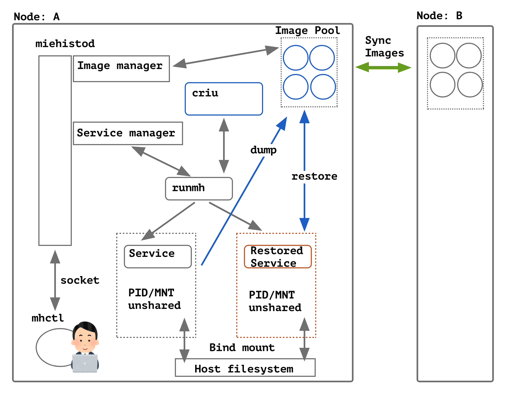

# Miehistö


Miehistö (formerly grenadine) is a checkpoint/restore manager for application servers, using CRIU(Checkpoint and Restore In Userspace) internally.

"Miehistö" is the Suomi(Finnish) word equivalent to CREW in English :)

## Architecture



TODO: write in some human languages.

## Install

### System requirement

* Kernel 3.11 (CRIU's requirement, newer is better)
* `criu` command and service (recommended: criu > 3.14)

### Binary/Package

TODO...

### Build from source

```bash
git clone https://github.com/udzura/miehitsto.git; cd miehisto
rake
sudo mv -v ./mruby/bin/* /usr/local/bin
```

* Both libcriu and libprce will be statically linked.
* Also see [mruby itself's prerequisites](https://github.com/mruby/mruby/blob/master/doc/guides/compile.md#prerequisites)

## Usage

### Start miehistod

```console
# All logs are put to stdout/err. TODO: Unit file
$ sudo miehistod >/var/log/miehistod.log 2>&1 &
```

### Create service via mhctl

```console
$ sudo mhctl service create /usr/bin/ruby -run -e httpd -- /var/www/html
$ curl localhost:8080
<h1>It works?</h1>

$ sudo mhctl service list
OBJECT_ID                        PID   PPID  ARGS
9491c63874fac947cc46d437b028b189 68248 68243 /usr/bin/ruby -run -e httpd -- /var/www/html
```

### Then, dump this process

```console
# TODO: specify by object_id
$ sudo mhctl service dump -t 68248
/var/lib/miehisto/images/742e79e9de83a9091424edb0fa463235

# Service will be stopped
$ sudo mhctl service list
OBJECT_ID                        PID   PPID  ARGS

$ curl localhost:8080
curl: (7) Failed to connect to localhost port 8080: Connection refused
```

### You will get some images

```console
$ sudo mhctl image list
OBJECT_ID                        COMM         PAGE_SIZE  CTIME
742e79e9de83a9091424edb0fa463235 ruby         21.41MiB   2020-11-13 12:37:30 +0000
e5912ffa22a8ed2f6ec35c1e4d463d4d memcached    792.00KiB  2020-11-13 07:22:50 +0000
```

### You can restore process from these images

```console
$ sudo mhctl service restore --from 742e79e9de83a9091424edb0fa463235
742e79e9de83a9091424edb0fa463235

$ sudo mhctl service list
OBJECT_ID                        PID   PPID  ARGS
9491c63874fac947cc46d437b028b189 68668 68660 /usr/bin/ruby -run -e httpd -- /var/www/html

# Works again!
$ curl localhost:8080
<h1>It works?</h1>
```

More information/usecases are TBD :(

## License

Under the MIT License. See LICENSE file.
